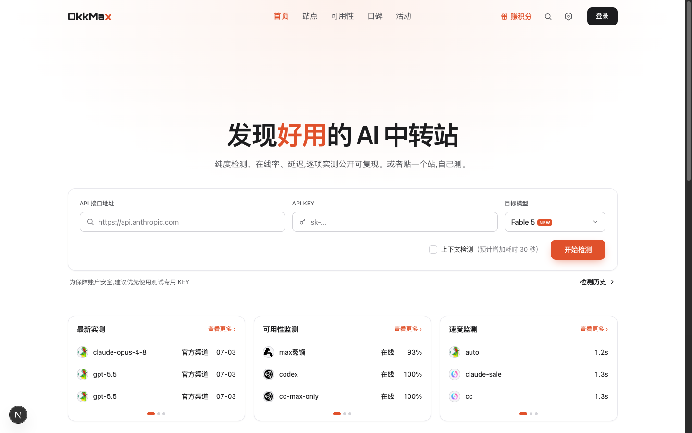
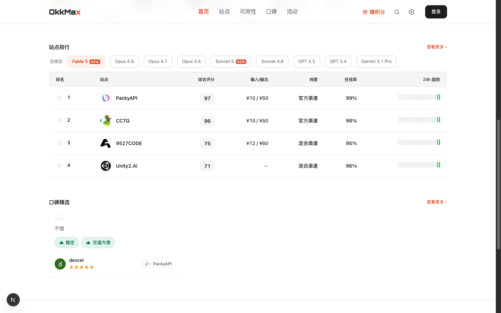
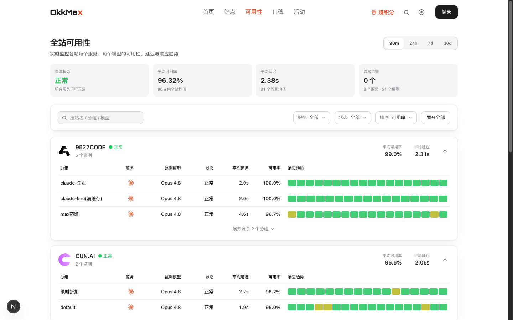
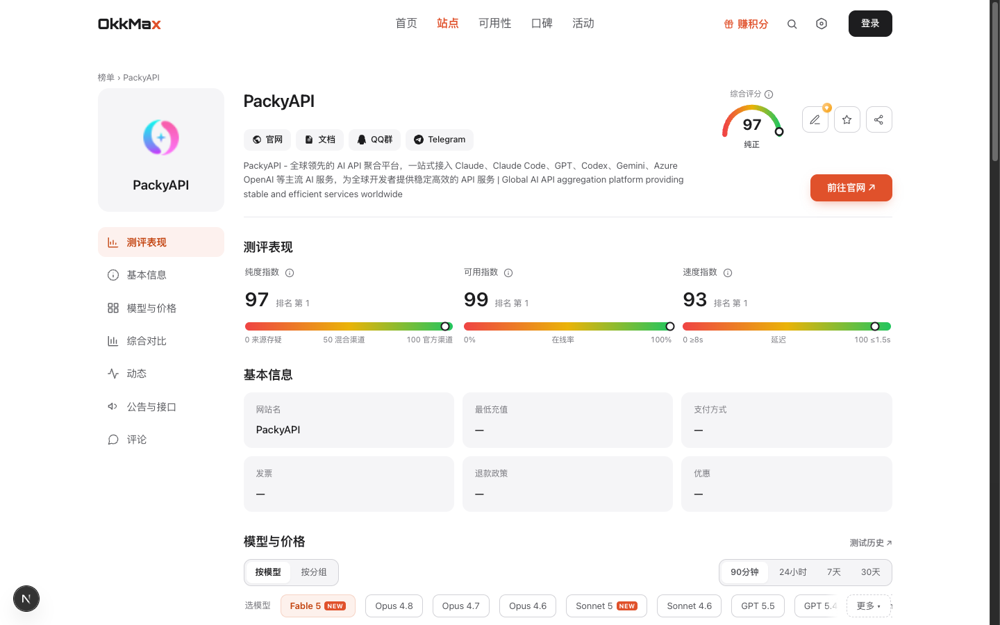
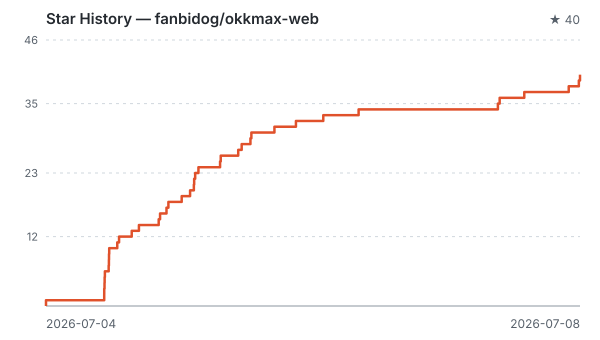

<div align="center">

# OkkMax

### Find AI API relay providers you can trust — authenticity checks · uptime monitoring · real user reviews

[](LICENSE)
[](https://nextjs.org)
[](https://www.prisma.io)
[](https://github.com/fanbidog/okkmax-web/pulls)
[](https://github.com/fanbidog/okkmax-web/stargazers)

### 🌐 Official website: **[www.okkmax.com](https://www.okkmax.com)**

An independent, third-party review and directory platform for AI API relay providers.
Every ranking score comes from automated probes; the methodology is public and auditable, and no fee can influence a ranking.

English | [中文](README_ZH.md)

</div>

---

## Why OkkMax?

The AI API relay market is a mixed bag: some providers route to genuine official backends, some silently swap Claude for cheaper models (quality downgrades), and some are online today and gone tomorrow. There's no way to verify before you pay — you only find out after falling into the pit.

**OkkMax keeps watch on two independent tracks:**

- **Automated objective testing**: scheduled probes using each provider's own account — authenticity verification (based on Anthropic thinking signatures, which cannot be forged), uptime, response latency, and pricing. Data flows straight into the database; nobody can hand-edit it.
- **Real user reviews**: ratings, comments and pros/cons tags from actual users, covering what probes can't measure (support, refunds, top-up experience).

Two independent tracks, cross-checked — so choosing a relay provider becomes reading data instead of gambling.

## Features

- 🏆 **Provider rankings**: composite score leaderboard (purity × availability × speed), filterable by model, covering the Claude / GPT / Gemini lineups
- 🔍 **Purity check**: thinking-signature-based authenticity verification with three-tier verdicts (official / mixed / questionable) — catches silent model swaps
- 📈 **Uptime monitoring**: minute-level continuous probing per provider and group, with 90m / 24h / 7d / 30d uptime and latency trends
- 💬 **Review community**: ratings, comments, pros/cons tags — one person, one vote, real experience
- 🧪 **Bring-your-own-key testing**: paste an endpoint and key to test any provider instantly; keys are used once and discarded, never stored
- 💰 **Price comparison**: input/output prices per model per provider at a glance; price changes are logged automatically as provider events
- 📢 **Provider events**: price changes, model additions/removals, purity tier changes — auto-generated event feed
- 🌍 **i18n**: Chinese / English, with pre-translated content
- 🎁 **Points system**: earn points from check-ins, tests, and reviews

## Screenshots

|              Home · instant test              |              Rankings              |
| :-------------------------------------------: | :--------------------------------: |
|           |  |

|              Uptime monitoring                |              Provider detail       |
| :-------------------------------------------: | :--------------------------------: |
|  |  |

## Quick Start (self-hosting)

Requirements: Node.js 20+, PostgreSQL.

```bash
git clone https://github.com/fanbidog/okkmax-web.git
cd okkmax-web
npm install
cp .env.example .env       # set DATABASE_URL
cp .env.example .env.local # set the rest as needed
npx prisma migrate deploy
npx prisma generate
npm run dev
```

Optional: seed demo data to see the pages in action.

```bash
npx tsx scripts/seed-test-stations.ts   # three demo providers + reviews
npx tsx scripts/seed-content.ts         # help-center docs
```

### Common commands

```bash
npm run dev     # development
npm run build   # production build
npm run test    # unit tests (vitest)
npm run ingest  # manually ingest a provider (format: scripts/seed.example.json)
npm run score   # compute scores and rankings (run on a cron)
```

## Architecture notes

This repository is OkkMax's website and data presentation layer (Next.js 16 full-stack + Prisma + PostgreSQL). To run a complete review platform of your own you'll also need:

- **A detection backend**: performs one-off provider tests, wired up via `DETECT_BASE_URL`; when unset, the bring-your-own-key test returns 501 and everything else works normally
- **An uptime monitor**: continuously collects uptime/latency and writes into this app's database (`UptimeSnapshot` and friends)
- **Scoring configuration**: weights and coefficients are set via `SCORE_*` environment variables, see [.env.example](.env.example)

## FAQ

<details>
<summary><strong>Can providers pay for a better ranking?</strong></summary>

No. All ranking scores come from automated probes and the methodology is public; commercial arrangements (such as referral links) never change probe data or tier verdicts.

</details>

<details>
<summary><strong>How does the purity check work?</strong></summary>

It relies on the thinking signature returned by Anthropic's official backend — a cryptographic marker that cannot be forged. A valid signature plus behaviour consistent with the official API confirms a genuine official channel. GPT / Gemini have no equivalent signature, so they only get protocol-level tests (connectivity, speed, uptime). See "Methodology" on the website.

</details>

<details>
<summary><strong>I run a relay provider — how do I get listed?</strong></summary>

Submit your provider at [www.okkmax.com/submit](https://www.okkmax.com/submit); if you dispute a score you can request a re-test.

</details>

<details>
<summary><strong>Is my API key safe when I run a test?</strong></summary>

The key is used only for that single test and then discarded — never written to the database or logs. We recommend using a dedicated test key.

</details>

## Star History

<a href="https://github.com/fanbidog/okkmax-web/stargazers"></a>

## License

[MIT](LICENSE) © OkkMax

---

<div align="center">

**Find this useful? Give it a ⭐ and help more people avoid the bad relays.**

[Website](https://www.okkmax.com) · [Rankings](https://www.okkmax.com/list) · [Uptime](https://www.okkmax.com/availability) · [Submit a provider](https://www.okkmax.com/submit)

</div>
