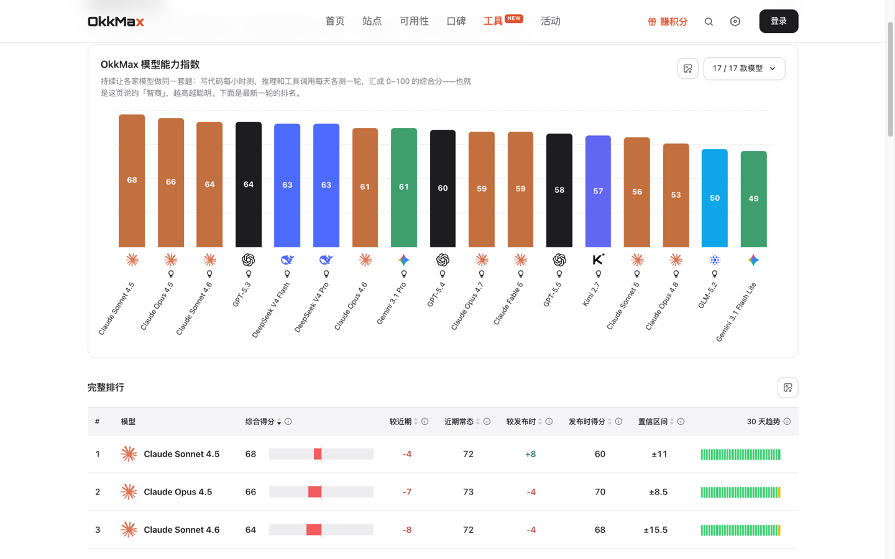

<div align="center">

# OkkMax

### 发现好用的 AI 中转站 —— 纯度检测 · 可用性监测 · 真实口碑

[](LICENSE)
[](https://nextjs.org)
[](https://www.prisma.io)
[](https://github.com/fanbidog/okkmax-web/pulls)
[](https://github.com/fanbidog/okkmax-web/stargazers)

### 🌐 官方网站:**[www.okkmax.com](https://www.okkmax.com)**

一个独立的第三方 AI API 中转站测评与导航平台。
榜单分数全部来自自动探针,判定方法公开可审计,不收取任何影响排名的费用。

[English](README.md) | 中文

</div>

---

## 为什么做 OkkMax?

AI API 中转站鱼龙混杂:有的走真官方渠道,有的偷偷把 Claude 换成廉价模型(俗称**降智 / 偷换**),有的今天能用明天跑路。买之前没法验货,买之后掉坑才知道。

**OkkMax 用两条互相独立的轨道帮你把关:**

- **机器客观实测**:用被测站自己的账号定时探测——真伪验证(基于 Anthropic 思维签名,无法伪造)、在线率、响应延迟、价格,数据自动入库,人工改不了
- **用户真实口碑**:真实用户的评分、评价与优缺点标签,覆盖探针测不到的体验(客服、售后、充值)

两条轨道分开统计、互为补充,让"选中转站"从赌运气变成看数据。

## 功能一览

- 🏆 **站点排行**:综合分榜单(纯度 × 可用 × 速度聚合),按模型筛选,支持 Claude / GPT / Gemini 全系
- 🧠 **模型智商榜**:主流大模型(Claude / Codex / GPT / Gemini)能力分每日同步,和各自基线对比看谁在悄悄降智;带 30 天趋势、推理/代码/工具调用分项排名,图表可导出
- 🔍 **纯度检测**:基于思维签名的真伪验证,三档判定(官方渠道 / 混合渠道 / 来源存疑),抓出降智偷换
- 📈 **可用性监测**:各站各分组分钟级持续探测,90 分钟 / 24 小时 / 7 天 / 30 天在线率与延迟趋势
- 💬 **口碑社区**:评分、评价、优缺点标签,一人一票真实体验
- 🧪 **自带 Key 自测**:贴上接口地址和 Key,即时检测任意站点;Key 用完即弃、不落库
- 💰 **价格对比**:各站各模型输入/输出价格一目了然,价格变动自动记入站点动态
- 📢 **站点动态**:涨降价、模型上下架、纯度档位变化,自动生成事件流
- 🌍 **多语言**:中 / 英双语,内容预翻译
- 🎁 **积分体系**:签到、检测、评价赚积分

## 界面预览

|               首页 · 自测入口               |               站点排行               |
| :-----------------------------------------: | :----------------------------------: |
|         |  |

|               可用性监测                |               站点详情               |
| :-------------------------------------: | :----------------------------------: |
|  |  |

|              模型智商榜              |
| :----------------------------------: |
|  |


## 快速开始(自部署)

要求:Node.js 20+、PostgreSQL。

```bash
git clone https://github.com/fanbidog/okkmax-web.git
cd okkmax-web
npm install
cp .env.example .env       # 填 DATABASE_URL
cp .env.example .env.local # 填其余变量(按需)
npx prisma migrate deploy
npx prisma generate
npm run dev
```

可选:灌入演示数据看页面效果。

```bash
npx tsx scripts/seed-test-stations.ts   # 三个演示站点 + 评价
npx tsx scripts/seed-content.ts         # 帮助中心文档
```

### 常用命令

```bash
npm run dev     # 开发
npm run build   # 生产构建
npm run test    # 单测(vitest)
npm run ingest  # 手动收录站点(格式见 scripts/seed.example.json)
npm run score   # 计算评分与排名(建议 cron 定时跑)
```

## 架构说明

本仓库是 OkkMax 的网站与数据展示层(Next.js 16 全栈 + Prisma + PostgreSQL)。完整运行一套自己的测评平台还需要:

- **检测后端**:执行单次站点检测,通过 `DETECT_BASE_URL` 接入;未配置时「自带 Key 自测」返回 501,其余功能不受影响
- **可用性监测**:持续采集在线率/延迟,写入本应用数据库(`UptimeSnapshot` 等表)
- **评分口径**:权重与系数通过 `SCORE_*` 环境变量配置,见 [.env.example](.env.example)

## FAQ

<details>
<summary><strong>榜单排名会收钱吗?</strong></summary>

不会。榜单分数全部来自自动探针,判定方法公开;商业合作(如返佣外链)不改变探针数据与档位判定。

</details>

<details>
<summary><strong>纯度检测的原理是什么?</strong></summary>

核心是 Anthropic 官方后端返回的思维签名(thinking signature)——一段无法伪造的加密标记。拿到有效签名且行为与官方一致,即可认定走的是真官方渠道。GPT / Gemini 没有等价签名,只做协议级测试(连通性、速度、在线率)。详见官网「评测方法」。

</details>

<details>
<summary><strong>我是站主,怎么收录我的站?</strong></summary>

到 [www.okkmax.com/submit](https://www.okkmax.com/submit) 提交站点信息即可;对分数有异议可申请复测。

</details>

<details>
<summary><strong>自测时填的 API Key 安全吗?</strong></summary>

Key 仅用于发起当次检测,用完即弃——不写数据库、不留日志。建议使用测试专用 Key。

</details>

## Star History

<a href="https://www.star-history.com/?repos=fanbidog%2Fokkmax-web&type=date&legend=top-left">
 <picture>
   <source media="(prefers-color-scheme: dark)" srcset="https://api.star-history.com/chart?repos=fanbidog/okkmax-web&type=date&theme=dark&legend=top-left&sealed_token=qPoWs19t8OTLx3nj6xu-AygbsiZTzFNGU5pfUpmssX2-kxUa2bwymwwkzGjijSBix5PdcjQykY1uBuCW5jHgOuRrkPmGYi3Mlp5ehiZ-eTsUwkH_bnWoQ6jT3qCMz7dYwfP21D5LHQy6kjtOTbXt6Bo69VzVPIE8do8t3_hrzC231O9q1s2E-hGwNntR" />
   <source media="(prefers-color-scheme: light)" srcset="https://api.star-history.com/chart?repos=fanbidog/okkmax-web&type=date&legend=top-left&sealed_token=qPoWs19t8OTLx3nj6xu-AygbsiZTzFNGU5pfUpmssX2-kxUa2bwymwwkzGjijSBix5PdcjQykY1uBuCW5jHgOuRrkPmGYi3Mlp5ehiZ-eTsUwkH_bnWoQ6jT3qCMz7dYwfP21D5LHQy6kjtOTbXt6Bo69VzVPIE8do8t3_hrzC231O9q1s2E-hGwNntR" />
   
 </picture>
</a>

## License

[MIT](LICENSE) © OkkMax

---

<div align="center">

**觉得有用?给个 ⭐ 支持一下,让更多人避开坑站。**

[官网](https://www.okkmax.com) · [站点排行](https://www.okkmax.com/list) · [可用性监测](https://www.okkmax.com/availability) · [提交站点](https://www.okkmax.com/submit)

</div>
